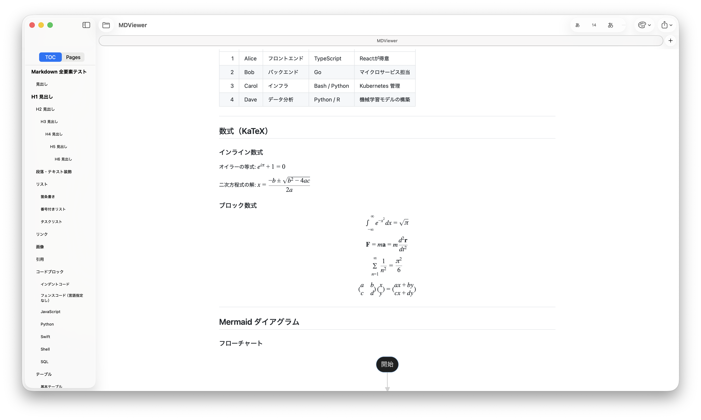

# MDViewer

開発者向けの軽量ネイティブ macOS Markdown ビューア。



## 概要

MDViewer は、ターミナルから Claude Code や Codex などのツールを使って作業する際に `.md` ファイルを素早く・シンプルに読みたいというニーズから生まれました。ブラウザやフルエディタのオーバーヘッドなしに、美しく Markdown をレンダリングします。

## 機能

- **即時レンダリング** — Markdown ファイルをすぐに開いて表示
- **ライブリロード** — ファイルの変更を監視し、保存のたびに自動再表示
- **目次サイドバー** — 見出しから自動生成、スムーズスクロール対応
- **シンタックスハイライト** — [Shiki v1](https://github.com/shikijs/shiki) による 27 言語対応
- **数式表示** — [KaTeX](https://github.com/KaTeX/KaTeX) によるインライン・ブロック LaTeX
- **Mermaid 図** — フローチャート、シーケンス図、ガントチャートなど
- **スマートリンク** — ローカル `.md` リンクはアプリ内で開き、外部リンクはブラウザへ
- **PDF エクスポート** — スタイルを保持したワンクリック PDF 出力
- **署名・公証済み** — Developer ID 署名と Apple 公証に対応

## 動作環境

- macOS 14 Sonoma 以降
- Apple Silicon（M1 以降）

## インストール

1. [Releases ページ](https://github.com/Masakai/mdviewer/releases/latest) から最新の `MDViewer-x.x.x.zip` をダウンロード
2. 解凍して `MDViewer.app` を **アプリケーション** フォルダにドラッグ
3. `.md` ファイルをダブルクリック、または Dock の MDViewer アイコンにドロップ

## ソースからビルド

Xcode 15 以降が必要です。

```sh
git clone https://github.com/Masakai/mdviewer.git
cd mdviewer
open MDViewer.xcodeproj
```

⌘R でビルド・実行。Swift Package の外部依存なし — すべてのベンダーライブラリは `MDViewer/Resources/Web/vendor/` にバンドル済みです。

## 技術スタック

| レイヤー | 技術 |
|---------|------|
| UI フレームワーク | SwiftUI + AppKit |
| レンダリングエンジン | WKWebView |
| Markdown パーサー | [marked](https://github.com/markedjs/marked) v12 |
| シンタックスハイライト | [Shiki](https://github.com/shikijs/shiki) v1 |
| 数式 | [KaTeX](https://github.com/KaTeX/KaTeX) v0.16 |
| 図 | [Mermaid](https://github.com/mermaid-js/mermaid) v10 |
| ファイル監視 | `DispatchSource`（kqueue） |

## オープンソースライブラリ

バンドルされているライブラリはすべて MIT ライセンスです。ライセンス全文は [THIRD_PARTY_NOTICES.md](THIRD_PARTY_NOTICES.md) を参照してください。

| ライブラリ | バージョン | ライセンス |
|-----------|-----------|-----------|
| marked | 12.0.2 | MIT |
| Shiki | 1.x | MIT |
| KaTeX | 0.16.11 | MIT |
| Mermaid | 10.x | MIT |

## ライセンス

MDViewer は [MIT License](LICENSE) のもとで公開されています。

© 2026 Masanori Sakai
