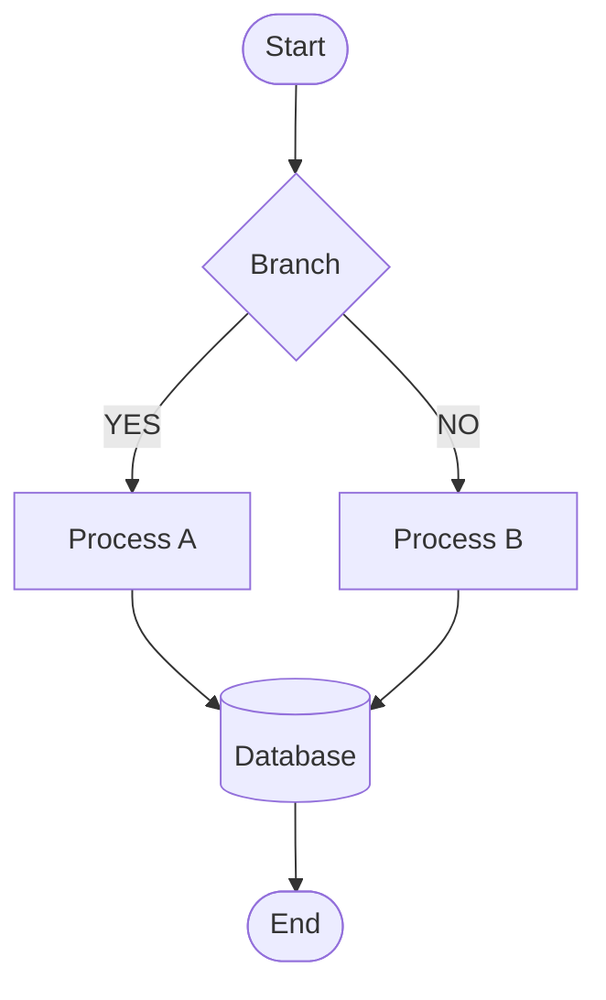
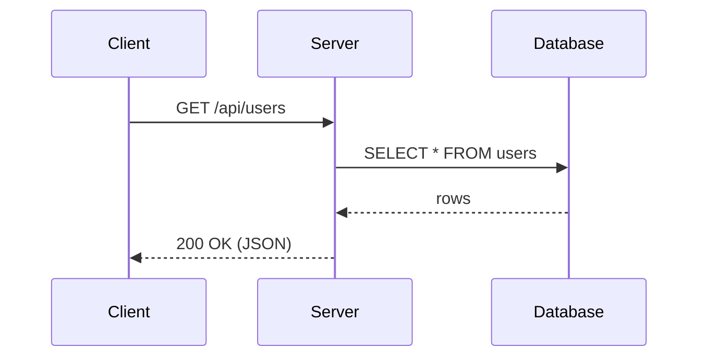
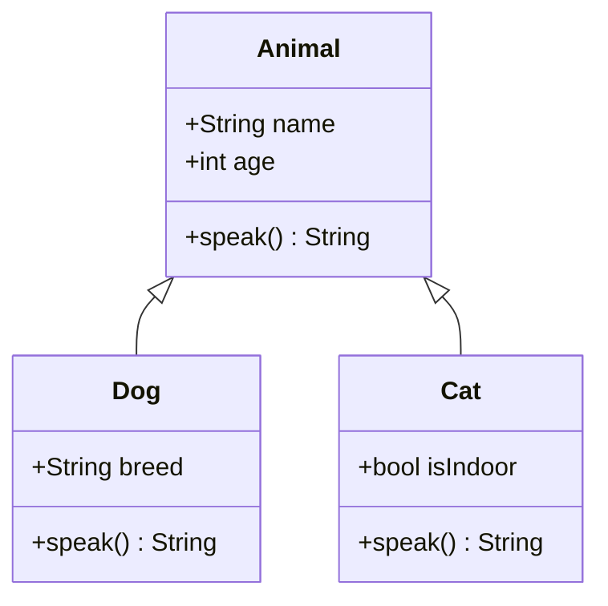
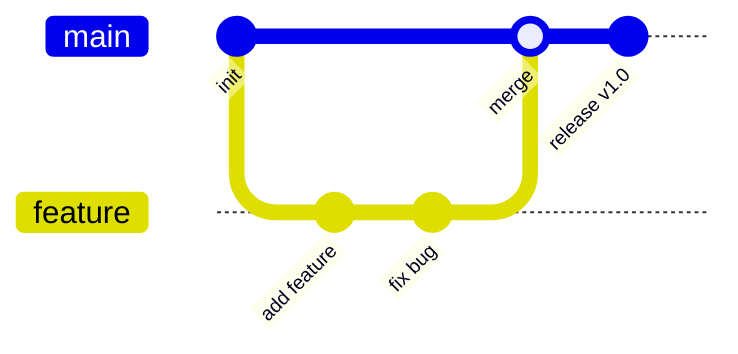

# Markdown All-Elements Test

## Headings

# H1 Heading
## H2 Heading
### H3 Heading
#### H4 Heading
##### H5 Heading
###### H6 Heading

---

## Paragraphs & Text Decoration

Normal paragraph text. Lorem ipsum dolor sit amet, consectetur adipiscing elit.

**Bold text** *Italic* ***Bold italic***

~~Strikethrough~~ `inline code`

<u>Underline</u> <mark>Highlight</mark> <small>Small text</small>

Superscript: X<sup>2</sup> Subscript: H<sub>2</sub>O

---

## Lists

### Bulleted List

- Item A
- Item B
  - Nested B-1
  - Nested B-2
    - Deep nested B-2-a
- Item C

### Numbered List

1. First item
2. Second item
   1. Nested 2-1
   2. Nested 2-2
3. Third item

### Task List

- [x] Completed task
- [x] Also completed
- [ ] Incomplete task
- [ ] Another incomplete task

---

## Links

[External link (to Google)](https://www.google.com)

[Link with title](https://www.example.com "Link to example.com")

<https://www.autolink-example.com>

<email@example.com>

---

## Images


---

## Blockquotes

> A single-line quote.

> A quote spanning multiple lines.
> Second line.
> Third line.

> Nested quote
> > Inner quote
> > > Even deeper quote

---

## Code Blocks

### Indented Code

    function hello() {
        return "world";
    }

### Fenced Code (no language specified)

```
plain text code block
no syntax highlighting
```

### JavaScript

```javascript
function fibonacci(n) {
    if (n <= 1) return n;
    return fibonacci(n - 1) + fibonacci(n - 2);
}

const result = fibonacci(10);
console.log(`Result: ${result}`);
```

### Python

```python
def quicksort(arr):
    if len(arr) <= 1:
        return arr
    pivot = arr[len(arr) // 2]
    left = [x for x in arr if x < pivot]
    mid  = [x for x in arr if x == pivot]
    right = [x for x in arr if x > pivot]
    return quicksort(left) + mid + quicksort(right)

print(quicksort([3, 6, 8, 10, 1, 2, 1]))
```

### Swift

```swift
struct Stack<T> {
    private var elements: [T] = []

    mutating func push(_ element: T) {
        elements.append(element)
    }

    mutating func pop() -> T? {
        elements.popLast()
    }

    var top: T? { elements.last }
}
```

### Shell

```bash
#!/bin/bash
for file in *.md; do
    echo "Processing: $file"
    wc -l "$file"
done
```

### SQL

```sql
SELECT u.name, COUNT(o.id) AS order_count
FROM users u
LEFT JOIN orders o ON u.id = o.user_id
WHERE u.created_at >= '2024-01-01'
GROUP BY u.id, u.name
ORDER BY order_count DESC
LIMIT 10;
```

---

## Tables

### Basic Table

| Col A | Col B | Col C |
|-------|-------|-------|
| Val 1 | Val 2 | Val 3 |
| Val 4 | Val 5 | Val 6 |
| Val 7 | Val 8 | Val 9 |

### Alignment

| Left   | Center   | Right  |
|:-------|:--------:|-------:|
| Apple  | Orange   | 100    |
| Banana | Grape    | 2500   |
| Cherry | Mango    | 38     |

### Long Table

| No. | Name  | Role           | Language      | Notes                       |
|----:|:------|:---------------|:--------------|:----------------------------|
|   1 | Alice | Frontend       | TypeScript    | Good at React               |
|   2 | Bob   | Backend        | Go            | In charge of microservices  |
|   3 | Carol | Infrastructure | Bash / Python | Kubernetes management       |
|   4 | Dave  | Data analysis  | Python / R    | Building machine-learning models |

---

## Math (KaTeX)

### Inline Math

Euler's identity: $e^{i\pi} + 1 = 0$

Solution of a quadratic equation: $x = \dfrac{-b \pm \sqrt{b^2 - 4ac}}{2a}$

### Block Math

$$
\int_{-\infty}^{\infty} e^{-x^2} dx = \sqrt{\pi}
$$

$$
\mathbf{F} = m\mathbf{a} = m\frac{d^2\mathbf{r}}{dt^2}
$$

$$
\sum_{n=1}^{\infty} \frac{1}{n^2} = \frac{\pi^2}{6}
$$

$$
\begin{pmatrix}
a & b \\
c & d
\end{pmatrix}
\begin{pmatrix}
x \\
y
\end{pmatrix}
=
\begin{pmatrix}
ax + by \\
cx + dy
\end{pmatrix}
$$

---

## Mermaid Diagrams

### Flowchart



### Sequence Diagram



### Class Diagram



### Git Graph



---

## Horizontal Rules

---

***

___

---

## HTML Tags (inline)

<details>
<summary>Click to expand</summary>

This content is collapsed.

- Item 1
- Item 2

</details>

<br>

Text after a line break.

<div style="color: steelblue; font-weight: bold;">Colored text (div)</div>

---

## Footnotes

You can put footnotes[^1] in the body text. You can also use multiple footnotes[^2].

[^1]: This is the first footnote.
[^2]: This is the second footnote. You can also write a long description here.

---

## Definition List (extension)

Term A
: Description of term A.

Term B
: Description of term B, part one.
: Description of term B, part two.

---

## Escaping

\*Escaped asterisks\* \`Escaped backticks\` \[Escaped square brackets\]

---

## Long Text (wrapping test)

I am a cat. As yet I have no name. I have no idea where I was born. All I remember is that I was mewing in a damp, gloomy place when, for the first time, I saw a human being. Moreover, I heard later that he was a member of the most ferocious species of human, a so-called student, the kind that is said to occasionally catch us, boil us, and eat us.

The quick brown fox jumps over the lazy dog. Pack my box with five dozen liquor jugs. How valiantly did Bez jot down my quack fox jumping over the wig.

---

*That's all — the all-elements test is complete.*
