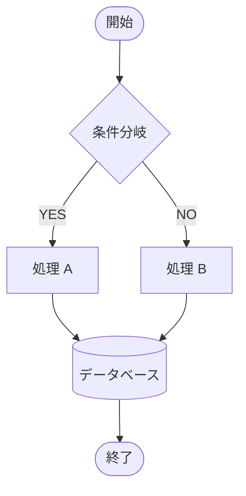
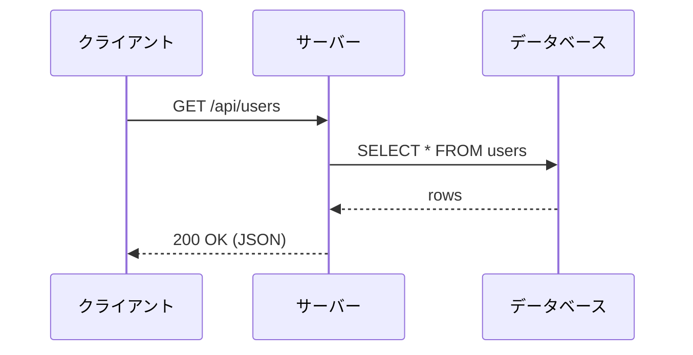
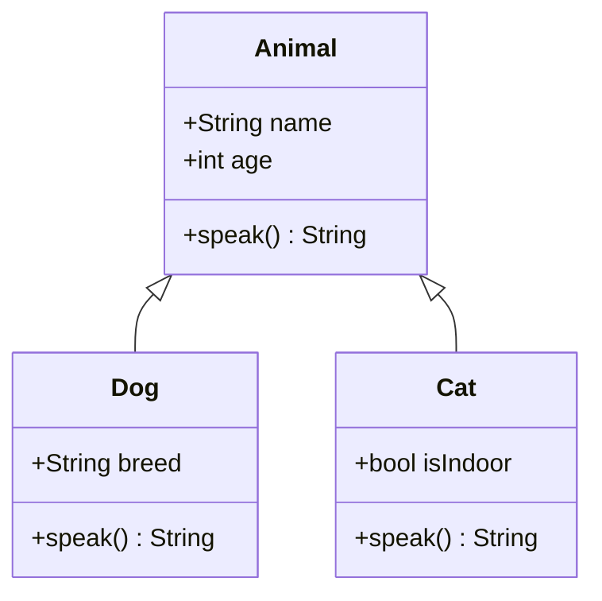
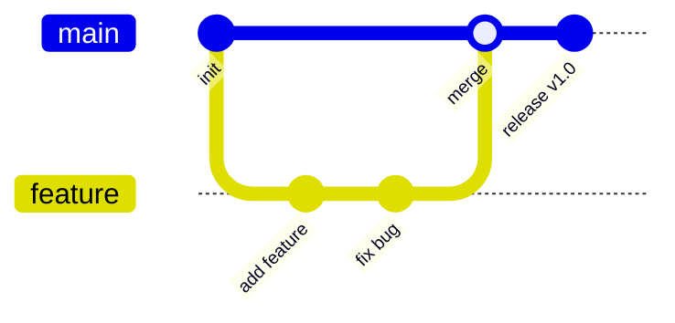

# Markdown 全要素テスト

## 見出し

# H1 見出し
## H2 見出し
### H3 見出し
#### H4 見出し
##### H5 見出し
###### H6 見出し

---

## 段落・テキスト装飾

通常の段落テキスト。Lorem ipsum dolor sit amet, consectetur adipiscing elit.

**太字テキスト**　*イタリック*　***太字イタリック***

~~取り消し線~~　`インラインコード`

<u>下線</u>　<mark>ハイライト</mark>　<small>小さいテキスト</small>

上付き: X<sup>2</sup>　下付き: H<sub>2</sub>O

---

## リスト

### 箇条書き

- 項目 A
- 項目 B
  - ネスト B-1
  - ネスト B-2
    - 深いネスト B-2-a
- 項目 C

### 番号付きリスト

1. 最初の項目
2. 二番目の項目
   1. ネスト 2-1
   2. ネスト 2-2
3. 三番目の項目

### タスクリスト

- [x] 完了したタスク
- [x] これも完了
- [ ] 未完了のタスク
- [ ] もう一つの未完了

---

## リンク

[外部リンク（Googleへ）](https://www.google.com)

[タイトル付きリンク](https://www.example.com "example.com へのリンク")

<https://www.autolink-example.com>

<email@example.com>

---

## 画像


---

## 引用

> 単一行の引用文。

> 複数行にわたる引用文。
> 二行目。
> 三行目。

> ネストされた引用
> > 内側の引用
> > > さらに深い引用

---

## コードブロック

### インデントコード

    function hello() {
        return "world";
    }

### フェンスコード（言語指定なし）

```
plain text code block
no syntax highlighting
```

### JavaScript

```javascript
function fibonacci(n) {
    if (n <= 1) return n;
    return fibonacci(n - 1) + fibonacci(n - 2);
}

const result = fibonacci(10);
console.log(`Result: ${result}`);
```

### Python

```python
def quicksort(arr):
    if len(arr) <= 1:
        return arr
    pivot = arr[len(arr) // 2]
    left = [x for x in arr if x < pivot]
    mid  = [x for x in arr if x == pivot]
    right = [x for x in arr if x > pivot]
    return quicksort(left) + mid + quicksort(right)

print(quicksort([3, 6, 8, 10, 1, 2, 1]))
```

### Swift

```swift
struct Stack<T> {
    private var elements: [T] = []

    mutating func push(_ element: T) {
        elements.append(element)
    }

    mutating func pop() -> T? {
        elements.popLast()
    }

    var top: T? { elements.last }
}
```

### Shell

```bash
#!/bin/bash
for file in *.md; do
    echo "Processing: $file"
    wc -l "$file"
done
```

### SQL

```sql
SELECT u.name, COUNT(o.id) AS order_count
FROM users u
LEFT JOIN orders o ON u.id = o.user_id
WHERE u.created_at >= '2024-01-01'
GROUP BY u.id, u.name
ORDER BY order_count DESC
LIMIT 10;
```

---

## テーブル

### 基本テーブル

| 列 A | 列 B | 列 C |
|------|------|------|
| 値 1 | 値 2 | 値 3 |
| 値 4 | 値 5 | 値 6 |
| 値 7 | 値 8 | 値 9 |

### 整列指定

| 左揃え | 中央揃え | 右揃え |
|:-------|:--------:|-------:|
| Apple  | Orange   | 100    |
| Banana | Grape    | 2500   |
| Cherry | Mango    | 38     |

### 長いテーブル

| No. | 名前           | 役割           | 言語         | 備考                         |
|----:|:---------------|:---------------|:-------------|:-----------------------------|
|   1 | Alice          | フロントエンド | TypeScript   | Reactが得意                  |
|   2 | Bob            | バックエンド   | Go           | マイクロサービス担当         |
|   3 | Carol          | インフラ       | Bash / Python | Kubernetes 管理              |
|   4 | Dave           | データ分析     | Python / R   | 機械学習モデルの構築         |

---

## 数式（KaTeX）

### インライン数式

オイラーの等式: $e^{i\pi} + 1 = 0$

二次方程式の解: $x = \dfrac{-b \pm \sqrt{b^2 - 4ac}}{2a}$

### ブロック数式

$$
\int_{-\infty}^{\infty} e^{-x^2} dx = \sqrt{\pi}
$$

$$
\mathbf{F} = m\mathbf{a} = m\frac{d^2\mathbf{r}}{dt^2}
$$

$$
\sum_{n=1}^{\infty} \frac{1}{n^2} = \frac{\pi^2}{6}
$$

$$
\begin{pmatrix}
a & b \\
c & d
\end{pmatrix}
\begin{pmatrix}
x \\
y
\end{pmatrix}
=
\begin{pmatrix}
ax + by \\
cx + dy
\end{pmatrix}
$$

---

## Mermaid ダイアグラム

### フローチャート



### シーケンス図



### クラス図



### Gitグラフ



---

## 水平線

---

***

___

---

## HTMLタグ（インライン）

<details>
<summary>クリックして展開</summary>

この中身は折りたたまれています。

- 項目 1
- 項目 2

</details>

<br>

改行後のテキスト。

<div style="color: steelblue; font-weight: bold;">カラー付きテキスト（div）</div>

---

## 脚注

本文中に脚注[^1]を入れることができます。複数の脚注[^2]も使えます。

[^1]: これが一つ目の脚注です。
[^2]: これが二つ目の脚注です。長い説明を書くこともできます。

---

## 定義リスト（拡張）

用語 A
: 用語 A の説明文。

用語 B
: 用語 B の説明文その一。
: 用語 B の説明文その二。

---

## エスケープ

\*アスタリスクをエスケープ\*　\`バッククォートをエスケープ\`　\[角括弧をエスケープ\]

---

## 長文テキスト（折り返しテスト）

吾輩は猫である。名前はまだ無い。どこで生れたかとんと見当がつかぬ。何でも薄暗いじめじめした所でニャーニャー泣いていた事だけは記憶している。吾輩はここで始めて人間というものを見た。しかもあとで聞くとそれは書生という人間中で一番獰悪な種族であったそうだ。

The quick brown fox jumps over the lazy dog. Pack my box with five dozen liquor jugs. How valiantly did Bez jot down my quack fox jumping over the wig.

---

*以上、全要素テスト完了。*
